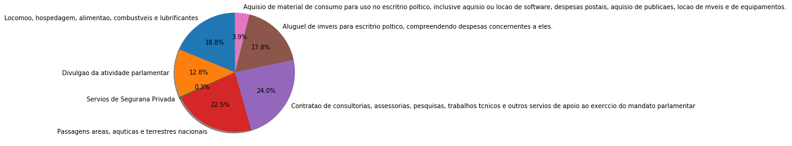
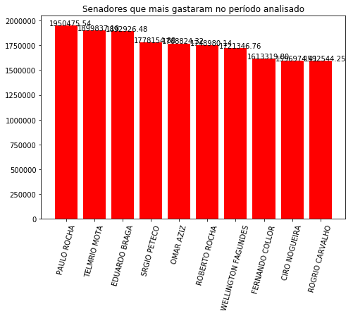
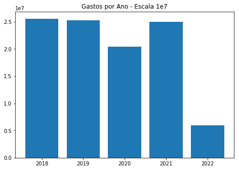
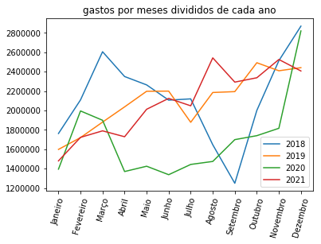
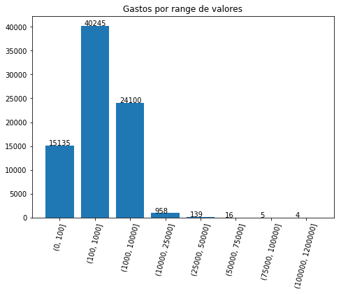

# Verificação  e Tratamento dos dados


```python
!hdfs dfs -ls /user/jordan/7_day_to_code
```

    Found 6 items
    drwxr-xr-x   - root supergroup          0 2022-04-12 21:03 /user/jordan/7_day_to_code/CEAPS
    -rw-r--r--   3 root supergroup    6951876 2022-04-12 19:58 /user/jordan/7_day_to_code/despesa_ceaps_2018.csv
    -rw-r--r--   3 root supergroup    5896424 2022-04-12 19:58 /user/jordan/7_day_to_code/despesa_ceaps_2019.csv
    -rw-r--r--   3 root supergroup    3725470 2022-04-12 19:58 /user/jordan/7_day_to_code/despesa_ceaps_2020.csv
    -rw-r--r--   3 root supergroup    4541732 2022-04-12 19:58 /user/jordan/7_day_to_code/despesa_ceaps_2021.csv
    -rw-r--r--   3 root supergroup     944537 2022-04-12 19:58 /user/jordan/7_day_to_code/despesa_ceaps_2022.csv


Depois disso, vou pegar as primeiras linhas dos arquivos para saber do que se tratam os dados


```python
!hdfs dfs -cat /user/jordan/7_day_to_code/despesa_ceaps_2018.csv | head -n 3
```

    
    
    
    cat: Unable to write to output stream.


Nota-se que se trata de um arquivo csv separador por ; Além disso eles estão com aspas . Outro ponto é que o cabeçalho é somente a partir da segunda linha, sendo a primeira somente a atualização


```python
from pyspark.sql.types import *

# Definindo o Schema dos Arquivos

columns_list = [
    StructField('ano', IntegerType()),
    StructField('mes', IntegerType()),
    StructField('senador', StringType()),
    StructField('tipo_despesa', StringType()),
    StructField('cnpj_cpf', StringType()),
    StructField('fornecedor', StringType()),
    StructField('documento', StringType()),
    StructField('data', DateType()),
    StructField('detalhamento', StringType()),
    StructField('valor_reembolsado', StringType()),
    StructField('cod_documento', IntegerType())
]

schema_names = StructType(columns_list)
```


```python
df = spark.read.csv('hdfs://namenode:8020/user/jordan/7_day_to_code/*.csv',
            quote='\"',
            mode='DROPMALFORMED',
            header=True,
            sep=';',
            schema=schema_names,
            dateFormat='dd/MM/yyyy',
            nullValue=None,
            nanValue=None,
        )
```


```python
from pyspark.sql.functions import *
```


```python
df = df.withColumn('valor_reembolsado', regexp_replace(df['valor_reembolsado'], '\.', ''))
df = df.withColumn('valor_reembolsado', regexp_replace(df['valor_reembolsado'], '\,', '.'))
df = df.withColumn('valor_reembolsado', df['valor_reembolsado'].cast(FloatType()))

df.orderBy(desc('valor_reembolsado')).select('valor_reembolsado').limit(5).show()
```

    +-----------------+
    |valor_reembolsado|
    +-----------------+
    |        2097125.0|
    |         120000.0|
    |         103900.0|
    |         102000.0|
    |         102000.0|
    +-----------------+
    


```python
df.dtypes
```


    [('ano', 'int'),
     ('mes', 'int'),
     ('senador', 'string'),
     ('tipo_despesa', 'string'),
     ('cnpj_cpf', 'string'),
     ('fornecedor', 'string'),
     ('documento', 'string'),
     ('data', 'date'),
     ('detalhamento', 'string'),
     ('valor_reembolsado', 'float'),
     ('cod_documento', 'int')]


```python
df = df.withColumn('cnpj', when(df['cnpj_cpf'].contains('/'), df['cnpj_cpf']))
df = df.withColumn('cpf', when(~df['cnpj_cpf'].contains('/'), df['cnpj_cpf']))
df = df.drop('cnpj_cpf')
df.show(5)
```

    +----+---+------------+--------------------+--------------------+---------+----------+--------------------+-----------------+-------------+------------------+--------------+
    | ano|mes|     senador|        tipo_despesa|          fornecedor|documento|      data|        detalhamento|valor_reembolsado|cod_documento|              cnpj|           cpf|
    +----+---+------------+--------------------+--------------------+---------+----------+--------------------+-----------------+-------------+------------------+--------------+
    |2018|  1|ACIR GURGACZ|Aluguel de im�vei...|GILBERTO PISELO D...|     null|2018-01-02|Despesa com pagam...|           6000.0|      2088462|              null|004.948.028-63|
    |2018|  1|ACIR GURGACZ|Passagens a�reas,...|TRANSCONTINENTAL ...|   M2CJMM|2018-01-02|Companhia A�rea: ...|           274.99|      2088476|63.764.211/0001-10|          null|
    |2018|  1|ACIR GURGACZ|Passagens a�reas,...|TRANSCONTINENTAL ...|   SFEXYF|2018-01-02|Companhia A�rea: ...|          1094.29|      2088528|63.764.211/0001-10|          null|
    |2018|  1|ACIR GURGACZ|Passagens a�reas,...|TRANSCONTINENTAL ...|   V64HTR|2018-01-24|Companhia A�rea: ...|          1553.99|      2088475|63.764.211/0001-10|          null|
    |2018|  2|ACIR GURGACZ|Aluguel de im�vei...|GILBERTO PISELO D...|   002/18|2018-02-01|Despesa com pagam...|           6000.0|      2088477|              null|004.948.028-63|
    +----+---+------------+--------------------+--------------------+---------+----------+--------------------+-----------------+-------------+------------------+--------------+
    only showing top 5 rows
    


```python
df.dtypes
```


    [('ano', 'int'),
     ('mes', 'int'),
     ('senador', 'string'),
     ('tipo_despesa', 'string'),
     ('fornecedor', 'string'),
     ('documento', 'string'),
     ('data', 'date'),
     ('detalhamento', 'string'),
     ('valor_reembolsado', 'float'),
     ('cod_documento', 'int'),
     ('cnpj', 'string'),
     ('cpf', 'string')]


Transformando dados de texto convertendo caracteres quebrados


```python
df = df.withColumn('detalhamento', regexp_replace(col('detalhamento'), '�', ''))
df = df.withColumn('tipo_despesa', regexp_replace(col('tipo_despesa'), '�', ''))
df = df.withColumn('fornecedor', regexp_replace(col('fornecedor'), '�', ''))
df = df.withColumn('senador', regexp_replace(col('senador'), '�', ''))
```


```python
df.select('senador', 'valor_reembolsado', 'data', 'tipo_despesa').limit(5).toPandas().head()
```


<div>
<style scoped>
    .dataframe tbody tr th:only-of-type {
        vertical-align: middle;
    }

    .dataframe tbody tr th {
        vertical-align: top;
    }

    .dataframe thead th {
        text-align: right;
    }
</style>
<table border="1" class="dataframe">
  <thead>
    <tr style="text-align: right;">
      <th></th>
      <th>senador</th>
      <th>valor_reembolsado</th>
      <th>data</th>
      <th>tipo_despesa</th>
    </tr>
  </thead>
  <tbody>
    <tr>
      <th>0</th>
      <td>ACIR GURGACZ</td>
      <td>6000.000000</td>
      <td>2018-01-02</td>
      <td>Aluguel de imveis para escritrio poltico, comp...</td>
    </tr>
    <tr>
      <th>1</th>
      <td>ACIR GURGACZ</td>
      <td>274.989990</td>
      <td>2018-01-02</td>
      <td>Passagens areas, aquticas e terrestres nacionais</td>
    </tr>
    <tr>
      <th>2</th>
      <td>ACIR GURGACZ</td>
      <td>1094.290039</td>
      <td>2018-01-02</td>
      <td>Passagens areas, aquticas e terrestres nacionais</td>
    </tr>
    <tr>
      <th>3</th>
      <td>ACIR GURGACZ</td>
      <td>1553.989990</td>
      <td>2018-01-24</td>
      <td>Passagens areas, aquticas e terrestres nacionais</td>
    </tr>
    <tr>
      <th>4</th>
      <td>ACIR GURGACZ</td>
      <td>6000.000000</td>
      <td>2018-02-01</td>
      <td>Aluguel de imveis para escritrio poltico, comp...</td>
    </tr>
  </tbody>
</table>
</div>


```python
df = df.na.drop('all')
df.count()
```


    80602


# Data Viz


```python
df.groupBy('tipo_despesa').agg(sum(col('valor_reembolsado')).alias('valor_tipo')).select('tipo_despesa', 'valor_tipo').show()
```

    +--------------------+--------------------+
    |        tipo_despesa|          valor_tipo|
    +--------------------+--------------------+
    |Locomoo, hospedag...| 1.921765544071073E7|
    |Divulgao da ativi...|1.3117358732982635E7|
    |Servios de Segura...|   299754.0463643074|
    |Passagens areas, ...|2.2960243133657932E7|
    |Contratao de cons...|2.4532545594053745E7|
    |Aluguel de imveis...| 1.817505150006883E7|
    |Aquisio de materi...|   3942412.376140723|
    +--------------------+--------------------+
    


```python
df_despesa_valor = df.groupBy('tipo_despesa').agg(sum(col('valor_reembolsado')).alias('valor por despesa')).select('tipo_despesa', 'valor por despesa').toPandas()
```


```python
df_despesa_valor.head()
```


<div>
<style scoped>
    .dataframe tbody tr th:only-of-type {
        vertical-align: middle;
    }

    .dataframe tbody tr th {
        vertical-align: top;
    }

    .dataframe thead th {
        text-align: right;
    }
</style>
<table border="1" class="dataframe">
  <thead>
    <tr style="text-align: right;">
      <th></th>
      <th>tipo_despesa</th>
      <th>valor por despesa</th>
    </tr>
  </thead>
  <tbody>
    <tr>
      <th>0</th>
      <td>Locomoo, hospedagem, alimentao, combustveis e ...</td>
      <td>1.921766e+07</td>
    </tr>
    <tr>
      <th>1</th>
      <td>Divulgao da atividade parlamentar</td>
      <td>1.311736e+07</td>
    </tr>
    <tr>
      <th>2</th>
      <td>Servios de Segurana Privada</td>
      <td>2.997540e+05</td>
    </tr>
    <tr>
      <th>3</th>
      <td>Passagens areas, aquticas e terrestres nacionais</td>
      <td>2.296024e+07</td>
    </tr>
    <tr>
      <th>4</th>
      <td>Contratao de consultorias, assessorias, pesqui...</td>
      <td>2.453255e+07</td>
    </tr>
  </tbody>
</table>
</div>


```python
labels = df_despesa_valor['tipo_despesa']
total = df_despesa_valor['valor por despesa'].sum()
sizes = df_despesa_valor['valor por despesa'] / total * 100
```


```python
import matplotlib.pyplot as plt
```

### Porcentagem de gastos por tipo de despesa


```python
fig1, ax1 = plt.subplots()

ax1.pie(sizes, labels=labels, autopct='%1.1f%%', shadow=True, startangle=90)

ax1.axis('equal')

plt.show()
```





### Senadores que mais gastaram no período analisado


```python
df_senador_despesa = df.groupBy('senador').agg(sum(col('valor_reembolsado')).alias('valor_por_senador')).orderBy(desc('valor_por_senador')).select('senador', 'valor_por_senador').limit(10).toPandas()
df_senador_despesa.head(10)
```


<div>
<style scoped>
    .dataframe tbody tr th:only-of-type {
        vertical-align: middle;
    }

    .dataframe tbody tr th {
        vertical-align: top;
    }

    .dataframe thead th {
        text-align: right;
    }
</style>
<table border="1" class="dataframe">
  <thead>
    <tr style="text-align: right;">
      <th></th>
      <th>senador</th>
      <th>valor_por_senador</th>
    </tr>
  </thead>
  <tbody>
    <tr>
      <th>0</th>
      <td>PAULO ROCHA</td>
      <td>1.950476e+06</td>
    </tr>
    <tr>
      <th>1</th>
      <td>TELMRIO MOTA</td>
      <td>1.899837e+06</td>
    </tr>
    <tr>
      <th>2</th>
      <td>EDUARDO BRAGA</td>
      <td>1.892926e+06</td>
    </tr>
    <tr>
      <th>3</th>
      <td>SRGIO PETECO</td>
      <td>1.778155e+06</td>
    </tr>
    <tr>
      <th>4</th>
      <td>OMAR AZIZ</td>
      <td>1.768824e+06</td>
    </tr>
    <tr>
      <th>5</th>
      <td>ROBERTO ROCHA</td>
      <td>1.748980e+06</td>
    </tr>
    <tr>
      <th>6</th>
      <td>WELLINGTON FAGUNDES</td>
      <td>1.721347e+06</td>
    </tr>
    <tr>
      <th>7</th>
      <td>FERNANDO COLLOR</td>
      <td>1.613320e+06</td>
    </tr>
    <tr>
      <th>8</th>
      <td>CIRO NOGUEIRA</td>
      <td>1.596974e+06</td>
    </tr>
    <tr>
      <th>9</th>
      <td>ROGRIO CARVALHO</td>
      <td>1.592544e+06</td>
    </tr>
  </tbody>
</table>
</div>


```python
import numpy as np

fig = plt.figure()

ax = fig.add_axes([0,0,1,1])
senadores = df_senador_despesa['senador']
valor = df_senador_despesa['valor_por_senador']

ax.bar(senadores,valor, color='red')

plt.xticks(rotation=75)

xlocs=[i+1 for i in range(0,10)]

plt.title('Senadores que mais gastaram no período analisado')

for i, v in enumerate(valor):
    plt.text(xlocs[i] - 1.6, v - 0.25, str('%.2f' % v))

plt.show()
```





## Gastos por Ano


```python
df_ano_despesa = df.groupBy('ano').agg(sum(col('valor_reembolsado')).alias('valor_por_ano')).select('ano', 'valor_por_ano').toPandas()
df_ano_despesa.head()
```


<div>
<style scoped>
    .dataframe tbody tr th:only-of-type {
        vertical-align: middle;
    }

    .dataframe tbody tr th {
        vertical-align: top;
    }

    .dataframe thead th {
        text-align: right;
    }
</style>
<table border="1" class="dataframe">
  <thead>
    <tr style="text-align: right;">
      <th></th>
      <th>ano</th>
      <th>valor_por_ano</th>
    </tr>
  </thead>
  <tbody>
    <tr>
      <th>0</th>
      <td>2018</td>
      <td>2.559512e+07</td>
    </tr>
    <tr>
      <th>1</th>
      <td>2022</td>
      <td>5.991514e+06</td>
    </tr>
    <tr>
      <th>2</th>
      <td>2019</td>
      <td>2.523278e+07</td>
    </tr>
    <tr>
      <th>3</th>
      <td>2020</td>
      <td>2.041492e+07</td>
    </tr>
    <tr>
      <th>4</th>
      <td>2021</td>
      <td>2.501068e+07</td>
    </tr>
  </tbody>
</table>
</div>


```python
fig = plt.figure()

ax = fig.add_axes([0,0,1,1])
ano = df_ano_despesa['ano']
valor = df_ano_despesa['valor_por_ano']

ax.bar(ano, valor)

plt.title('Gastos por Ano - Escala 1e7')

plt.show()
```





## Gráficos de gastos por meses divididos por anos


```python
df_meses_ano_despesa = df.groupBy('ano','mes').agg(sum(col('valor_reembolsado')).alias('valor_por_ano')).select('ano','mes','valor_por_ano').toPandas()

df_meses_ano_despesa = df_meses_ano_despesa.sort_values(['ano', 'mes'])
df_meses_ano_despesa = df_meses_ano_despesa.reset_index()

# Remover o ano de 2022 pois está incompleto

df_meses_ano_despesa = df_meses_ano_despesa[df_meses_ano_despesa['ano'] != 2022]

df_meses_ano_despesa.groupby('ano').count()
```


<div>
<style scoped>
    .dataframe tbody tr th:only-of-type {
        vertical-align: middle;
    }

    .dataframe tbody tr th {
        vertical-align: top;
    }

    .dataframe thead th {
        text-align: right;
    }
</style>
<table border="1" class="dataframe">
  <thead>
    <tr style="text-align: right;">
      <th></th>
      <th>index</th>
      <th>mes</th>
      <th>valor_por_ano</th>
    </tr>
    <tr>
      <th>ano</th>
      <th></th>
      <th></th>
      <th></th>
    </tr>
  </thead>
  <tbody>
    <tr>
      <th>2018</th>
      <td>12</td>
      <td>12</td>
      <td>12</td>
    </tr>
    <tr>
      <th>2019</th>
      <td>12</td>
      <td>12</td>
      <td>12</td>
    </tr>
    <tr>
      <th>2020</th>
      <td>12</td>
      <td>12</td>
      <td>12</td>
    </tr>
    <tr>
      <th>2021</th>
      <td>12</td>
      <td>12</td>
      <td>12</td>
    </tr>
  </tbody>
</table>
</div>


```python
meses = ['Janeiro', 'Fevereiro', 'Março', 'Abril', 'Maio', 'Junho',
        'Julho', 'Agosto', 'Setembro', 'Outubro', 'Novembro', 'Dezembro']

a_2018 = df_meses_ano_despesa[df_meses_ano_despesa['ano'] == 2018]['valor_por_ano']
a_2019 = df_meses_ano_despesa[df_meses_ano_despesa['ano'] == 2019]['valor_por_ano']
a_2020 = df_meses_ano_despesa[df_meses_ano_despesa['ano'] == 2020]['valor_por_ano']
a_2021 = df_meses_ano_despesa[df_meses_ano_despesa['ano'] == 2021]['valor_por_ano']


plt.plot(meses, a_2018, label='2018')
plt.plot(meses, a_2019, label='2019')
plt.plot(meses, a_2020, label='2020')
plt.plot(meses, a_2021, label='2021')

plt.legend(loc='best')

plt.title('gastos por meses divididos de cada ano')

plt.xticks(rotation=75)

plt.show()
```





## Distribuição de gastos por valor


```python
import pandas as pd
import numpy as np

df_valores = df.select('valor_reembolsado').toPandas()

ranges_list = [0, 100, 1000, 10000, 25000, 50000, 75000, 100000, 1200000]

range_ = pd.cut(df_valores['valor_reembolsado'], [0, 100, 1000, 10000, 25000, 50000, 75000, 100000, 1200000])
counts = pd.value_counts(range_, sort=False)
```


```python
fig = plt.figure()

ax = fig.add_axes([0,0,1,1])

ax.bar(counts.index.astype(str), counts.to_numpy())

xlocs=[i+1 for i in range(0,10)]

for i, v in enumerate(counts.to_numpy()):
    plt.text(xlocs[i] - 1.3, v + 1, str(v))


plt.title('Gastos por range de valores')

plt.xticks(rotation=75)

plt.show()
```




