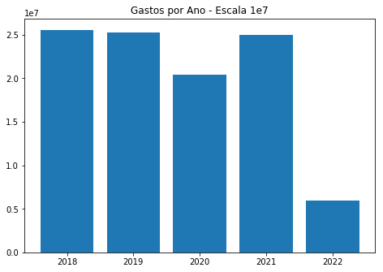
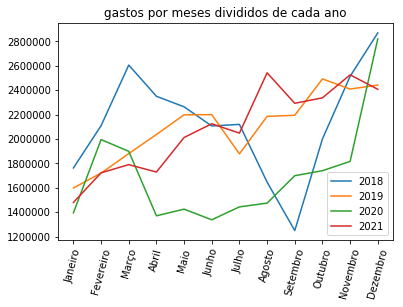

# CEAPS ANALYSIS

## Descrição
A princípio a proposta desse processamento e dessa análise foi o [7days of Code](https://7daysofcode.io/matricula/data-science) da Alura em Data Science. Porém no foi realizado todo o procedimento pois muitas dessas partes eu não tenho um foco muito grande (Não no momento), como modelos de Machine, predição, etc. 

Eu resolvi usar partes que eu já sabia e algumas outras que eu aprendi na hora de desenvolvedor. As duas principais tarefas que eu tive foi com o Spark e com o Matplotlib.

### Spark 

Por estar fazendo um curso com módulos em Spark (Data Atual: 14 de Abril de 2022) eu já tinha certo conhecimento prévio de Spark e processamento distribuído. Nesse projeto eu apenas coloquei alguns dos conhecimento em prática.

### Matplotlib

Antes desse projeto eu nunca havia usado o matplotlib, já tinha ouvido falar, visto alguns vídeos, porém nunca usei em algo desse tipo, então foi bem complicado.


## Desenvolvimento

A primeira parte para desenvolver o projeto foi pegar os dados da fonte, o 7Days of Code deu a sugestão de buscar os dados da CEAPS (Cota para Exercício da Atividade Parlamentar dos Senadores)

Uma vez que foram baixados os dados - (você acha eles aqui: [CEAPS](https://www12.senado.leg.br/transparencia/dados-abertos-transparencia/dados-abertos-ceaps)) - resolvi utilizar um cluster de big data já existente dentre os principais itens desse cluster está o Hadoop, composto pelo namenode e por um datanode, e por um nó de Spark.


O que fiz foi enviar os dados para o namenode no docker, pois o cluster está conteinerizado e do namenode coloquei os arquivos no HDFS

Enviei os dados para o container do namenode:

`docker cp data/ namenode:/data`

Acessei o container do docker:
`docker exec -it namenode bash`

E Após isso utilizei os comandos do HDFS:

Criar a pasta para os dados: 

`hdfs dfs -mkdir /user/jordan/7_day_to_code`

Enviar os dados da pasta /data para a pasta criada:

`hdfs dfs -put /data/* /user/jordan/7_day_to_code`

Após isso uma verificação para ver os os arquivos foram realmente enviandos
```
root@namenode:/# hdfs dfs -ls /user/jordan/7_day_to_code
Found 5 items
-rw-r--r--   3 root supergroup    6951876 2022-04-12 19:58 /user/jordan/7_day_to_code/despesa_ceaps_2018.csv
-rw-r--r--   3 root supergroup    5896424 2022-04-12 19:58 /user/jordan/7_day_to_code/despesa_ceaps_2019.csv
-rw-r--r--   3 root supergroup    3725470 2022-04-12 19:58 /user/jordan/7_day_to_code/despesa_ceaps_2020.csv
-rw-r--r--   3 root supergroup    4541732 2022-04-12 19:58 /user/jordan/7_day_to_code/despesa_ceaps_2021.csv
-rw-r--r--   3 root supergroup     944537 2022-04-12 19:58 /user/jordan/7_day_to_code/despesa_ceaps_2022.csv
```

Após isso, os comandos foram executados em um Jupyter Notebook Utilizando o Kernel do PySpark

## Verificação  e Tratamento dos dados

Primeiro eu dei uma outra checada através do Notebook para ver se os dados estavam disponíveis e se o Jupyter estava configurado para acessar o HDFS

```python
!hdfs dfs -ls /user/jordan/7_day_to_code
```

    Found 6 items
    drwxr-xr-x   - root supergroup          0 2022-04-12 21:03 /user/jordan/7_day_to_code/CEAPS
    -rw-r--r--   3 root supergroup    6951876 2022-04-12 19:58 /user/jordan/7_day_to_code/despesa_ceaps_2018.csv
    -rw-r--r--   3 root supergroup    5896424 2022-04-12 19:58 /user/jordan/7_day_to_code/despesa_ceaps_2019.csv
    -rw-r--r--   3 root supergroup    3725470 2022-04-12 19:58 /user/jordan/7_day_to_code/despesa_ceaps_2020.csv
    -rw-r--r--   3 root supergroup    4541732 2022-04-12 19:58 /user/jordan/7_day_to_code/despesa_ceaps_2021.csv
    -rw-r--r--   3 root supergroup     944537 2022-04-12 19:58 /user/jordan/7_day_to_code/despesa_ceaps_2022.csv


Após ter certeza de que os dados estavam disponíveis eu precisava saber com o que eu estava mexendo, os tipos de dados, as colunas, realmente saber como eu poderia realizar a leitura dos arquivos

```python
!hdfs dfs -cat /user/jordan/7_day_to_code/despesa_ceaps_2018.csv | head -n 3
```
    "ULTIMA ATUALIZACAO";"06/08/2021 02:06"
    "ANO";"MES";"SENADOR";"TIPO_DESPESA";"CNPJ_CPF";"FORNECEDOR";"DOCUMENTO";"DATA";"DETALHAMENTO";"VALOR_REEMBOLSADO";"COD_DOCUMENTO"
    "2018";"1";"ACIR GURGACZ";"Aluguel de im�veis para escrit�rio pol�tico, compreendendo despesas concernentes a eles.";"004.948.028-63";"GILBERTO PISELO DO NASCIMENTO";"";"02/01/2018";"Despesa com pagamento de aluguel de im�vel para o escrit�rio do Senador Acir Gurgacz";"6000";"2088462"


A partir daqui eu já sabia como era a estrutura do csv e que os mesmos eram separados por ; e com aspas separando os dados. Outro ponto é que o cabeçalho é somente a partir da segunda linha, sendo a primeira somente a atualização.

### Dificuldades na parte de leitura
Eu demorei muito, muito, muito tempo para retirar essa primeira linha de atualização. Primeiramente eu tentei ler os dados como RDD e excluir a primeira linha, depois transformar em DataFrame e realizar o resto do processamento. Tentei ler como DataFrame Spark e Transformar em um Dataframe Pandas e com o auxílio do atributo `.loc` realizar a remoção da primeira linha de atualização, porém, pensando em um Cluster de Big Data isso vai tirar todo o propósito de processamento distribuído e isso também deixou o Kernel do PySpark muito lento, embora resolvesse a solução.. Então essa parte foi muito complicada para mim pois eu não tinha me deparado com nada parecido


A solução foi mais simples do que eu imaginava. Eu criei um Schema, defini os campos que havia e na leitura do arquivo csv com o `spark.read` eu passei o seguinte parâmetro `mode='DROPMALFORMED'`
que removou a primeira linha pois ela não se encaixava no Schema

```python
from pyspark.sql.types import *

# Definindo o Schema dos Arquivos
columns_list = [
    StructField('ano', IntegerType()),
    StructField('mes', IntegerType()),
    StructField('senador', StringType()),
    StructField('tipo_despesa', StringType()),
    StructField('cnpj_cpf', StringType()),
    StructField('fornecedor', StringType()),
    StructField('documento', StringType()),
    StructField('data', DateType()),
    StructField('detalhamento', StringType()),
    StructField('valor_reembolsado', StringType()),
    StructField('cod_documento', IntegerType())
]

schema_names = StructType(columns_list)
```
```python
df = spark.read.csv('hdfs://namenode:8020/user/jordan/7_day_to_code/*.csv',
            quote='\"',
            mode='DROPMALFORMED',
            header=True,
            sep=';',
            schema=schema_names,
            dateFormat='dd/MM/yyyy',
            nullValue=None,
            nanValue=None,
        )
```


```python
from pyspark.sql.functions import *
```
Após a leitura o primeiro atributo que fiz uma mudanção foi o campo de valor_reembolsado que antes estava como string e foi realizado o parse para o tipo Float, que ajudaria em algumas transformações que envolviam contagens:

```python
df = df.withColumn('valor_reembolsado', regexp_replace(df['valor_reembolsado'], '\.', ''))
df = df.withColumn('valor_reembolsado', regexp_replace(df['valor_reembolsado'], '\,', '.'))
df = df.withColumn('valor_reembolsado', df['valor_reembolsado'].cast(FloatType()))

df.orderBy(desc('valor_reembolsado')).select('valor_reembolsado').limit(5).show()
```

    +-----------------+
    |valor_reembolsado|
    +-----------------+
    |        2097125.0|
    |         120000.0|
    |         103900.0|
    |         102000.0|
    |         102000.0|
    +-----------------+
    

Após o processo de tornar o campo em Float, verifiquei se a mudança tinha sido validada:
```python
df.dtypes
```
    [('ano', 'int'),
     ('mes', 'int'),
     ('senador', 'string'),
     ('tipo_despesa', 'string'),
     ('cnpj_cpf', 'string'),
     ('fornecedor', 'string'),
     ('documento', 'string'),
     ('data', 'date'),
     ('detalhamento', 'string'),
     ('valor_reembolsado', 'float'),
     ('cod_documento', 'int')]

Depois de validada a mudança, decidi separar os campos de CPNJ e CPF (Porém somente depois descobri que não usei esse dado pra nada,  porém devo fazer alguma coisa com ele no futuro - ou não)
```python
df = df.withColumn('cnpj', when(df['cnpj_cpf'].contains('/'), df['cnpj_cpf']))
df = df.withColumn('cpf', when(~df['cnpj_cpf'].contains('/'), df['cnpj_cpf']))
df = df.drop('cnpj_cpf')
df.show(5)
```
    +----+---+------------+--------------------+--------------------+---------+----------+--------------------+-----------------+-------------+------------------+--------------+
    | ano|mes|     senador|        tipo_despesa|          fornecedor|documento|      data|        detalhamento|valor_reembolsado|cod_documento|              cnpj|           cpf|
    +----+---+------------+--------------------+--------------------+---------+----------+--------------------+-----------------+-------------+------------------+--------------+
    |2018|  1|ACIR GURGACZ|Aluguel de im�vei...|GILBERTO PISELO D...|     null|2018-01-02|Despesa com pagam...|           6000.0|      2088462|              null|004.948.028-63|
    |2018|  1|ACIR GURGACZ|Passagens a�reas,...|TRANSCONTINENTAL ...|   M2CJMM|2018-01-02|Companhia A�rea: ...|           274.99|      2088476|63.764.211/0001-10|          null|
    |2018|  1|ACIR GURGACZ|Passagens a�reas,...|TRANSCONTINENTAL ...|   SFEXYF|2018-01-02|Companhia A�rea: ...|          1094.29|      2088528|63.764.211/0001-10|          null|
    |2018|  1|ACIR GURGACZ|Passagens a�reas,...|TRANSCONTINENTAL ...|   V64HTR|2018-01-24|Companhia A�rea: ...|          1553.99|      2088475|63.764.211/0001-10|          null|
    |2018|  2|ACIR GURGACZ|Aluguel de im�vei...|GILBERTO PISELO D...|   002/18|2018-02-01|Despesa com pagam...|           6000.0|      2088477|              null|004.948.028-63|
    +----+---+------------+--------------------+--------------------+---------+----------+--------------------+-----------------+-------------+------------------+--------------+
    only showing top 5 rows
    
Um outro problema, porém esse já era mais esperado é o fato de que o Spark somente faz os processamentos depois de uma ação ser solicitada. Então todas as transformações que geravam erros e eu não printava, eu só descobria depois que o processo anterior deu erro, e isso me custo um tempo considerável.

Isso seria facilmente resolvido se eu estivesse utilizando Spark Scala ou Java com DataSets, porém como o Cluster Já estava configurado para PySpark, optei por continuar.

Depois, resolvi remover os caracteres quebrados. Acabei não substituindo por nada, pois não sei o que faço quando tem caractéres assim. 
```python
df = df.withColumn('detalhamento', regexp_replace(col('detalhamento'), '�', ''))
df = df.withColumn('tipo_despesa', regexp_replace(col('tipo_despesa'), '�', ''))
df = df.withColumn('fornecedor', regexp_replace(col('fornecedor'), '�', ''))
df = df.withColumn('senador', regexp_replace(col('senador'), '�', ''))
```

```python
df.select('senador', 'valor_reembolsado', 'data', 'tipo_despesa').limit(5).toPandas().head()
```

<div>
<style scoped>
    .dataframe tbody tr th:only-of-type {
        vertical-align: middle;
    }

    .dataframe tbody tr th {
        vertical-align: top;
    }

    .dataframe thead th {
        text-align: right;
    }
</style>
<table border="1" class="dataframe">
  <thead>
    <tr style="text-align: right;">
      <th></th>
      <th>senador</th>
      <th>valor_reembolsado</th>
      <th>data</th>
      <th>tipo_despesa</th>
    </tr>
  </thead>
  <tbody>
    <tr>
      <th>0</th>
      <td>ACIR GURGACZ</td>
      <td>6000.000000</td>
      <td>2018-01-02</td>
      <td>Aluguel de imveis para escritrio poltico, comp...</td>
    </tr>
    <tr>
      <th>1</th>
      <td>ACIR GURGACZ</td>
      <td>274.989990</td>
      <td>2018-01-02</td>
      <td>Passagens areas, aquticas e terrestres nacionais</td>
    </tr>
    <tr>
      <th>2</th>
      <td>ACIR GURGACZ</td>
      <td>1094.290039</td>
      <td>2018-01-02</td>
      <td>Passagens areas, aquticas e terrestres nacionais</td>
    </tr>
    <tr>
      <th>3</th>
      <td>ACIR GURGACZ</td>
      <td>1553.989990</td>
      <td>2018-01-24</td>
      <td>Passagens areas, aquticas e terrestres nacionais</td>
    </tr>
    <tr>
      <th>4</th>
      <td>ACIR GURGACZ</td>
      <td>6000.000000</td>
      <td>2018-02-01</td>
      <td>Aluguel de imveis para escritrio poltico, comp...</td>
    </tr>
  </tbody>
</table>
</div>

Na maioria das vezes eu decidi exibir os dados com o Pandas, pois a visualização fica mais simples. Porém eu sempre limitava os dados para evitar transformar todos os dados em um formato pandas.


Após isso, decidi deletar todos os campos com dados nulos.
```python
df = df.na.drop('all')
df.count()
```
    80602


# Visualização dos dados.

Para mim essa foi uma parte totalmente nova. Eu não sabia o que eu exibiria, como eu exibiria e tudo mais. Porém depois de um tempinho debruçado sobre os dados decidi pegar algumas coisas que achei que fossem relevantes

## Porcentagem de gastos por tipo de despesa

O primeiro dado que decidi visualizar foi a porcetagem de dados divididos por tipo de despesa, pois manipulando um pouco os dados, percebi que haviam poucos tipos de despesa e que eles seriam de fácil visualização:

A primeira coisa que decidi fazer foi agrupar os dados que eu queria e transformar em um dataframe pandas que eu já estava mais habituado, embora eu não tenha usado muitas funções exclusivas do Pandas.
```python
df.groupBy('tipo_despesa').agg(sum(col('valor_reembolsado')).alias('valor_tipo')).select('tipo_despesa', 'valor_tipo').show()
```

    +--------------------+--------------------+
    |        tipo_despesa|          valor_tipo|
    +--------------------+--------------------+
    |Locomoo, hospedag...| 1.921765544071073E7|
    |Divulgao da ativi...|1.3117358732982635E7|
    |Servios de Segura...|   299754.0463643074|
    |Passagens areas, ...|2.2960243133657932E7|
    |Contratao de cons...|2.4532545594053745E7|
    |Aluguel de imveis...| 1.817505150006883E7|
    |Aquisio de materi...|   3942412.376140723|
    +--------------------+--------------------+
    


```python
df_despesa_valor = df.groupBy('tipo_despesa').agg(sum(col('valor_reembolsado')).alias('valor por despesa')).select('tipo_despesa', 'valor por despesa').toPandas()
```


```python
df_despesa_valor.head()
```


<div>
<style scoped>
    .dataframe tbody tr th:only-of-type {
        vertical-align: middle;
    }

    .dataframe tbody tr th {
        vertical-align: top;
    }

    .dataframe thead th {
        text-align: right;
    }
</style>
<table border="1" class="dataframe">
  <thead>
    <tr style="text-align: right;">
      <th></th>
      <th>tipo_despesa</th>
      <th>valor por despesa</th>
    </tr>
  </thead>
  <tbody>
    <tr>
      <th>0</th>
      <td>Locomoo, hospedagem, alimentao, combustveis e ...</td>
      <td>1.921766e+07</td>
    </tr>
    <tr>
      <th>1</th>
      <td>Divulgao da atividade parlamentar</td>
      <td>1.311736e+07</td>
    </tr>
    <tr>
      <th>2</th>
      <td>Servios de Segurana Privada</td>
      <td>2.997540e+05</td>
    </tr>
    <tr>
      <th>3</th>
      <td>Passagens areas, aquticas e terrestres nacionais</td>
      <td>2.296024e+07</td>
    </tr>
    <tr>
      <th>4</th>
      <td>Contratao de consultorias, assessorias, pesqui...</td>
      <td>2.453255e+07</td>
    </tr>
  </tbody>
</table>
</div>


```python
labels = df_despesa_valor['tipo_despesa']
total = df_despesa_valor['valor por despesa'].sum()
sizes = df_despesa_valor['valor por despesa'] / total * 100
```


```python
import matplotlib.pyplot as plt
```
```python
fig1, ax1 = plt.subplots()

ax1.pie(sizes, labels=labels, autopct='%1.1f%%', shadow=True, startangle=90)

ax1.axis('equal')

plt.show()
```


## Senadores que mais gastaram no período analisado
Após saber a porcetagem de cada tipo de gasto, peguei os Senadores que mais gastaram nesse período:

```python
df_senador_despesa = df.groupBy('senador').agg(sum(col('valor_reembolsado')).alias('valor_por_senador')).orderBy(desc('valor_por_senador')).select('senador', 'valor_por_senador').limit(10).toPandas()
df_senador_despesa.head(10)
```

<div>
<style scoped>
    .dataframe tbody tr th:only-of-type {
        vertical-align: middle;
    }

    .dataframe tbody tr th {
        vertical-align: top;
    }

    .dataframe thead th {
        text-align: right;
    }
</style>
<table border="1" class="dataframe">
  <thead>
    <tr style="text-align: right;">
      <th></th>
      <th>senador</th>
      <th>valor_por_senador</th>
    </tr>
  </thead>
  <tbody>
    <tr>
      <th>0</th>
      <td>PAULO ROCHA</td>
      <td>1.950476e+06</td>
    </tr>
    <tr>
      <th>1</th>
      <td>TELMRIO MOTA</td>
      <td>1.899837e+06</td>
    </tr>
    <tr>
      <th>2</th>
      <td>EDUARDO BRAGA</td>
      <td>1.892926e+06</td>
    </tr>
    <tr>
      <th>3</th>
      <td>SRGIO PETECO</td>
      <td>1.778155e+06</td>
    </tr>
    <tr>
      <th>4</th>
      <td>OMAR AZIZ</td>
      <td>1.768824e+06</td>
    </tr>
    <tr>
      <th>5</th>
      <td>ROBERTO ROCHA</td>
      <td>1.748980e+06</td>
    </tr>
    <tr>
      <th>6</th>
      <td>WELLINGTON FAGUNDES</td>
      <td>1.721347e+06</td>
    </tr>
    <tr>
      <th>7</th>
      <td>FERNANDO COLLOR</td>
      <td>1.613320e+06</td>
    </tr>
    <tr>
      <th>8</th>
      <td>CIRO NOGUEIRA</td>
      <td>1.596974e+06</td>
    </tr>
    <tr>
      <th>9</th>
      <td>ROGRIO CARVALHO</td>
      <td>1.592544e+06</td>
    </tr>
  </tbody>
</table>
</div>


```python
import numpy as np

fig = plt.figure()

ax = fig.add_axes([0,0,1,1])
senadores = df_senador_despesa['senador']
valor = df_senador_despesa['valor_por_senador']

ax.bar(senadores,valor, color='red')

plt.xticks(rotation=75)

xlocs=[i+1 for i in range(0,10)]

plt.title('Senadores que mais gastaram no período analisado')

for i, v in enumerate(valor):
    plt.text(xlocs[i] - 1.6, v - 0.25, str('%.2f' % v))

plt.show()
```


## Gastos por Ano
Depois dos senadores, decidi visualizar os valores dos gastos separados por ano.

```python
df_ano_despesa = df.groupBy('ano').agg(sum(col('valor_reembolsado')).alias('valor_por_ano')).select('ano', 'valor_por_ano').toPandas()
df_ano_despesa.head()
```


<div>
<style scoped>
    .dataframe tbody tr th:only-of-type {
        vertical-align: middle;
    }

    .dataframe tbody tr th {
        vertical-align: top;
    }

    .dataframe thead th {
        text-align: right;
    }
</style>
<table border="1" class="dataframe">
  <thead>
    <tr style="text-align: right;">
      <th></th>
      <th>ano</th>
      <th>valor_por_ano</th>
    </tr>
  </thead>
  <tbody>
    <tr>
      <th>0</th>
      <td>2018</td>
      <td>2.559512e+07</td>
    </tr>
    <tr>
      <th>1</th>
      <td>2022</td>
      <td>5.991514e+06</td>
    </tr>
    <tr>
      <th>2</th>
      <td>2019</td>
      <td>2.523278e+07</td>
    </tr>
    <tr>
      <th>3</th>
      <td>2020</td>
      <td>2.041492e+07</td>
    </tr>
    <tr>
      <th>4</th>
      <td>2021</td>
      <td>2.501068e+07</td>
    </tr>
  </tbody>
</table>
</div>


```python
fig = plt.figure()

ax = fig.add_axes([0,0,1,1])
ano = df_ano_despesa['ano']
valor = df_ano_despesa['valor_por_ano']

ax.bar(ano, valor)

plt.title('Gastos por Ano - Escala 1e7')

plt.show()
```





## Gráficos de gastos por meses divididos por anos
E a visualização anterior me deu um insight para eu verificar os gastos de cada mês dos anos. Talvez esse tenha sido um dos gráficos que mais deu trabalho para fazer por conta das legendas, que me tirou um tempo até entender, colocar várias linhas no mesmo gráfico e fazer o agrupamento dos dados.

```python
df_meses_ano_despesa = df.groupBy('ano','mes').agg(sum(col('valor_reembolsado')).alias('valor_por_ano')).select('ano','mes','valor_por_ano').toPandas()

df_meses_ano_despesa = df_meses_ano_despesa.sort_values(['ano', 'mes'])
df_meses_ano_despesa = df_meses_ano_despesa.reset_index()

# Remover o ano de 2022 pois está incompleto

df_meses_ano_despesa = df_meses_ano_despesa[df_meses_ano_despesa['ano'] != 2022]

df_meses_ano_despesa.groupby('ano').count()
```


<div>
<style scoped>
    .dataframe tbody tr th:only-of-type {
        vertical-align: middle;
    }

    .dataframe tbody tr th {
        vertical-align: top;
    }

    .dataframe thead th {
        text-align: right;
    }
</style>
<table border="1" class="dataframe">
  <thead>
    <tr style="text-align: right;">
      <th></th>
      <th>index</th>
      <th>mes</th>
      <th>valor_por_ano</th>
    </tr>
    <tr>
      <th>ano</th>
      <th></th>
      <th></th>
      <th></th>
    </tr>
  </thead>
  <tbody>
    <tr>
      <th>2018</th>
      <td>12</td>
      <td>12</td>
      <td>12</td>
    </tr>
    <tr>
      <th>2019</th>
      <td>12</td>
      <td>12</td>
      <td>12</td>
    </tr>
    <tr>
      <th>2020</th>
      <td>12</td>
      <td>12</td>
      <td>12</td>
    </tr>
    <tr>
      <th>2021</th>
      <td>12</td>
      <td>12</td>
      <td>12</td>
    </tr>
  </tbody>
</table>
</div>


```python
meses = ['Janeiro', 'Fevereiro', 'Março', 'Abril', 'Maio', 'Junho',
        'Julho', 'Agosto', 'Setembro', 'Outubro', 'Novembro', 'Dezembro']

a_2018 = df_meses_ano_despesa[df_meses_ano_despesa['ano'] == 2018]['valor_por_ano']
a_2019 = df_meses_ano_despesa[df_meses_ano_despesa['ano'] == 2019]['valor_por_ano']
a_2020 = df_meses_ano_despesa[df_meses_ano_despesa['ano'] == 2020]['valor_por_ano']
a_2021 = df_meses_ano_despesa[df_meses_ano_despesa['ano'] == 2021]['valor_por_ano']


plt.plot(meses, a_2018, label='2018')
plt.plot(meses, a_2019, label='2019')
plt.plot(meses, a_2020, label='2020')
plt.plot(meses, a_2021, label='2021')

plt.legend(loc='best')

plt.title('gastos por meses divididos de cada ano')

plt.xticks(rotation=75)

plt.show()
```





## Distribuição de gastos por valor
Por fim, decidi pegar o range de valores que mais foram gastos. Sendo X o Range Observado e Y a quantidade de vezes que um valor foi reembolsado naquele range de valor. Aqui eu nunca tinha usado os atributos `pd.cut` e `pd.value_counts`  então também levei um tempo até entender mais ou menos o funcionamento.

```python
import pandas as pd
import numpy as np

df_valores = df.select('valor_reembolsado').toPandas()

ranges_list = [0, 100, 1000, 10000, 25000, 50000, 75000, 100000, 1200000]

range_ = pd.cut(df_valores['valor_reembolsado'], [0, 100, 1000, 10000, 25000, 50000, 75000, 100000, 1200000])
counts = pd.value_counts(range_, sort=False)
```


```python
fig = plt.figure()

ax = fig.add_axes([0,0,1,1])

ax.bar(counts.index.astype(str), counts.to_numpy())

xlocs=[i+1 for i in range(0,10)]

for i, v in enumerate(counts.to_numpy()):
    plt.text(xlocs[i] - 1.3, v + 1, str(v))


plt.title('Gastos por range de valores')

plt.xticks(rotation=75)

plt.show()
```


# Considerações Finais.
Espero Melhorar isso em breve. Qualquer sugestão é bem vinda e qualquer problema encontrado, pode ser falado que vou tentar resolver. :)

Além disso, o Notebook usado, está nesse mesmo repositório, fique a vontade para usar da maneira que desejar. Só não esquece de dar os créditos hehe.